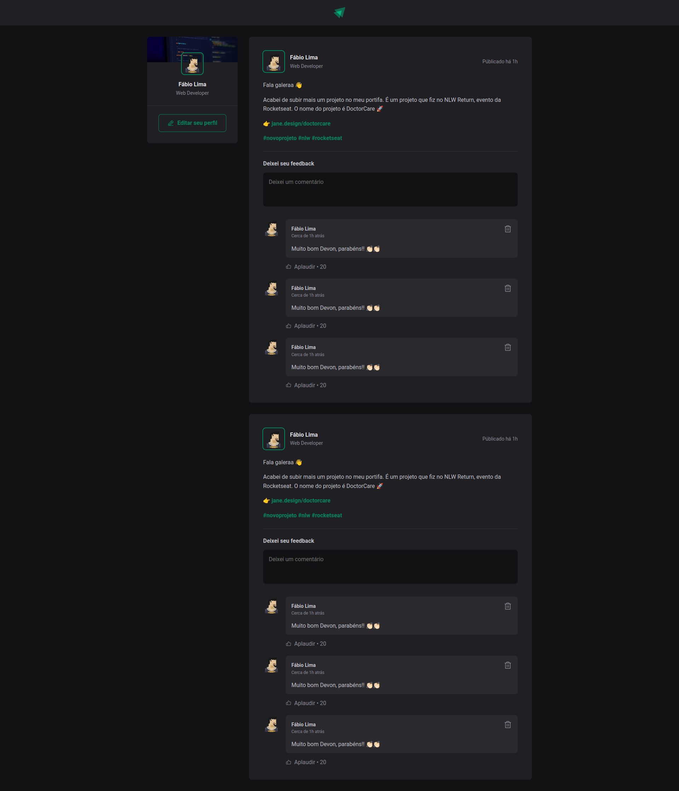

# Ignite Feed

  

## Table Of Content

- [Description](#description)

- [Installation](#installation)
- [Usage](#usage)

- [GitHub](#github)
- [Contact](#contact)
- [License](#license)

  

## Description

  This project was created from studies of ReactJS. The idea is to use current technologies like ReactJS and Vite initially. Over time, new updates will be made

   
Homepage

## Installation

- npm install

Ignite Feed is built with the following tools and libraries: <ul><li>ReactJS</li><li>ViteJS</li><li>phosphor-react</li><li>TypeScript</li></ul>

## Usage
 
First: git clone this repository;
Second: enter on folder to clone and run: npm install;
Third: Now, to start the project, just run: npm run dev;

## GitHub

<a href="https://github.com/faablima"><strong>faablima</a></strong>

## Contact

Feel free to reach out to me on my email:
fabiogomeslma@gmail.com

## License

